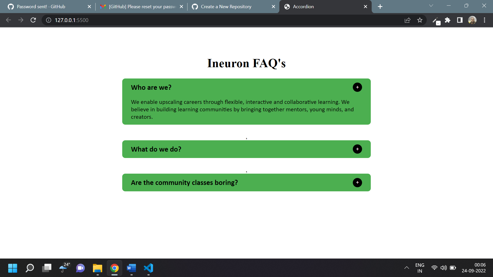

# Tailwind Assignment Paytm UI Clone

## Accordian [Live Link](https://accordian-js.netlify.app/)

- Skills Gained in this project

  - insert HTML markup through insertAdjacentHTML

  - add and remove classes

---

## Time taken to finish this project

- 1 hour to complete it

#### Screenshot

